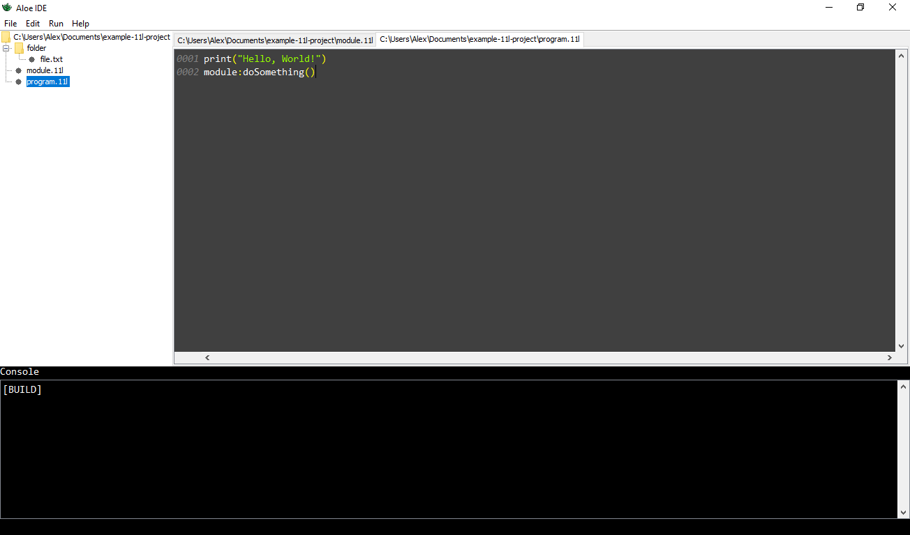

# Aloe IDE
  <br>
 
 This is a repository of Aloe IDE. An IDE for 11l development. <br>
 
## Features
 - Code editing and syntax highlight
 - Autocomplete
 - 3 standard themes
 - Integration with 11l compiler
 - Errors highlight
 - Plugins and custom themes
## Usage
 1. Download and extract archive from releases 
 2. Download Java, Python and Visual Studio Build Tools (windows) or GCC 9+ (linux) 
 3. On Windows run aloe.exe; On Linux compile and run aloe.11l
 See README in archive for full info
## Plugins 
### Creating
You can create your own plugins for Aloe IDE! Just create a Java class that implements ```AloePlugin``` and download latest
Aloe API from releases. Then override method ```start()```. Aloe IDE is calling this method when it starts.
#### ```AloeTheme```
```AloeTheme``` is an interface that allow you to create themes. You have to implement 4 methods: 
``` 
    /**
     * @return theme name for SettingsWindow
     */
    String getThemeName();

    /**
     * @return Runnable which starts when this theme is selected
     */
    Runnable applyTheme();

    /**
     * @return foreground Color of this themes
     */
    Color getForeground();

    /**
     * @return background Color of this themes
     */
    Color getBackground();
```
```Runnable applyTheme();``` method should look like that
```]
import io.github.fawgio.aloe.api.AloePlugin;
import io.github.fawgio.aloe.api.AloeTheme;
import io.github.fawgio.aloe.highlight.SyntaxHighlighter;
import java.awt.Color;
import javax.swing.text.StyleConstants;

public class LightTheme implements AloePlugin, AloeTheme {
    public Runnable applyTheme(){
        return () -> {
            StyleConstants.setItalic(stringSet, false);
            StyleConstants.setBold(stringSet, false);
            StyleConstants.setForeground(stringSet, new Color(150,250,0));

            StyleConstants.setItalic(numberSet, false);
            StyleConstants.setBold(numberSet, false);
            StyleConstants.setForeground(numberSet, new Color(0,250,250));

            StyleConstants.setItalic(boolSet, false);
            StyleConstants.setBold(boolSet, true);
            StyleConstants.setForeground(boolSet, new Color(0,250,250));

            StyleConstants.setItalic(keywordSet, false);
            StyleConstants.setBold(keywordSet, true);
            StyleConstants.setForeground(keywordSet, Color.MAGENTA);

            StyleConstants.setItalic(otherSet, false);
            StyleConstants.setBold(otherSet, false);
            StyleConstants.setForeground(otherSet, Color.YELLOW);

            StyleConstants.setItalic(nothingSet, false);
            StyleConstants.setBold(nothingSet, false);
            StyleConstants.setForeground(nothingSet, Color.WHITE);

            StyleConstants.setBold(commentSet, false);
            StyleConstants.setItalic(commentSet, true);
            StyleConstants.setForeground(commentSet, new Color(180,200,180));
        }
    }
    
    //TODO implement other methods
}
```
To compile your plugin use ```javac YourPlugin.java```
See [api]() for examples
### Usage
 All plugins must store in the plugins folder and Aloe will load and run them on start
